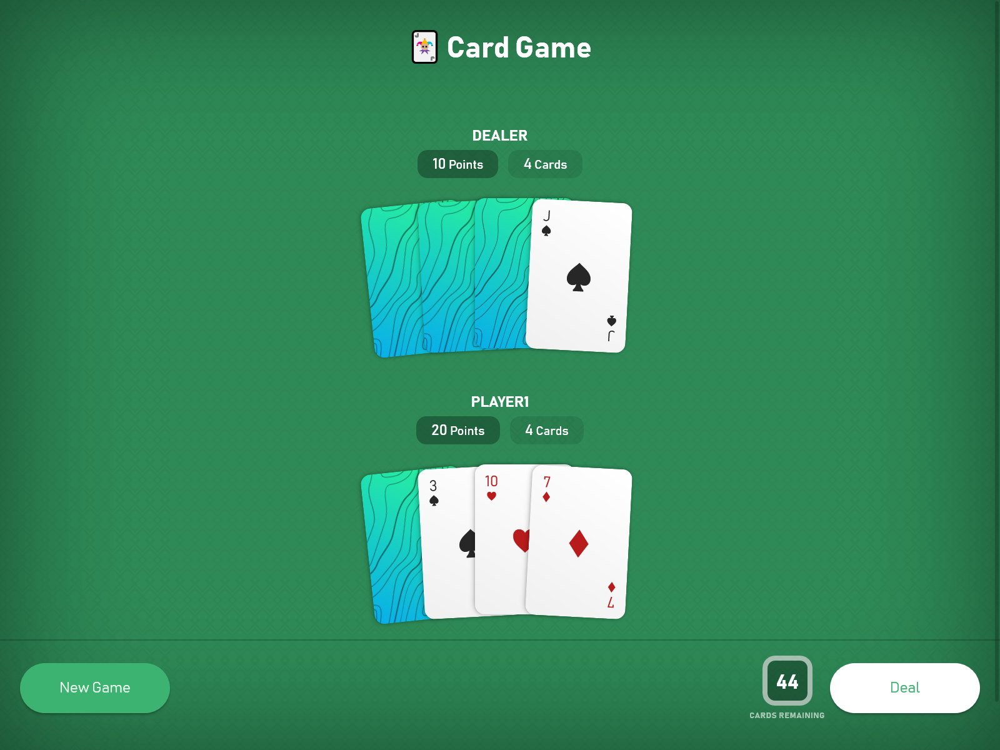

# Card Game
This is a web app game that lets you flip cards and collect points against a dealer.
### [Click to Play!](https://shetharp.github.io/card-game/)

## Gameplay
To play the game, click the `Start Game` button. We play with a standard deck of 52 cards. Clicking the `Deal` button deals a card to all players, including the dealer. You calculate points by flipping cards face up.

## Development
This is a React web app bootstrapped with [Create React App](http://github.com/facebook/create-react-app).
The card game is managed with the [Deck of Cards API](http://deckofcardsapi.com/).

The following `npm` packages were also used:
* `axios` for API service calls
* `styled-components` for CSS in JS styling

## Local Install
To install this web app locally, follow these steps.
1. Clone this repo.
2. Navigate to the this project's directory and run `npm install`
3. To begin developing, run `npm start`
4. To build the project for deployment, run `npm run build`

## Making this your own
This web app was built with extensibility and future scalability in mind.

### Multiple Players
Out of the box, this game supports multiple players. You can also change the default player's name to something other than `dealer`. These settings, along with others, are included in the `src/api/settings.js` file.

### Unshuffled Deck
By default we play with a shuffled deck. You can customize this in the `src/api/settings.js` file.

### Theme
Basic theme settings are stored in the `src/styles/theme.js` file. Further customizations are easy to do with `styled-components` as everything needed to style a component is included in its component file.

### Custom Cards
The Cards used in this game are designed with CSS. They are _not images._ You can customize the both the Back and the Front of the Card by editing the Card component file in `src/components/Card.js`.

### Managing Hands
The game currently requests to `Draw` a card from the deck and add it to that player's `pile` (AKA hand) through the API. To reduce latency and minimize the number of API calls, the game does not request the API to list each player's hand each time a card is drawn. The game only requests the API to list each player's hand if a previous game is being resumed to reinitialize the game state.

### Save Game
This game currently supports resuming the most recently played game. The game stores the `deckID` from the Deck of Cards API in the user's `localStorage` to resume the game. Currently, _the game does not store any other information besides the `deckID`._

## Potential New Features and Future Dev Work
* Allow players to draw cards independently
* Implement a game of Blackjack
* Design the cards to show the corresponding number of suit symbols based on its value
* Design face cards with only CSS
* Save multiple games with `localStorage`
* Create an algorithm to automate the dealer's game strategy
* Get a new deck once the current one runs out
